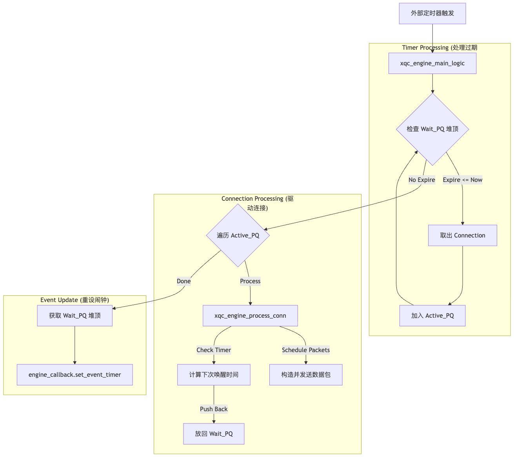
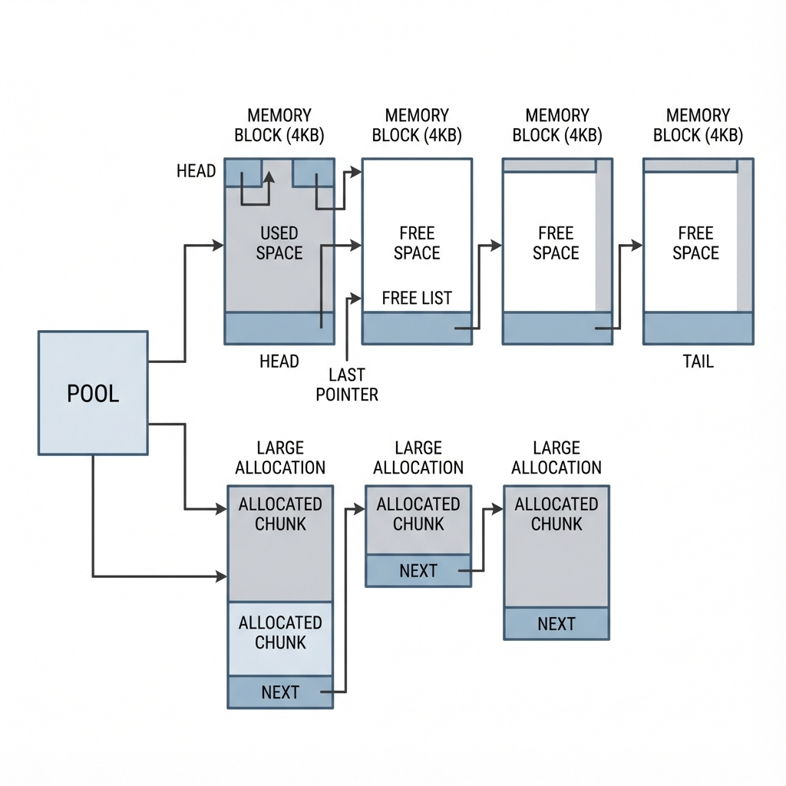
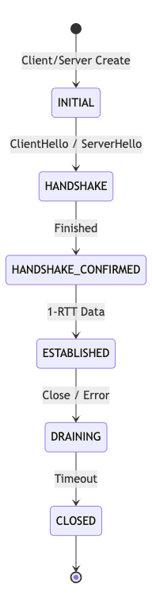
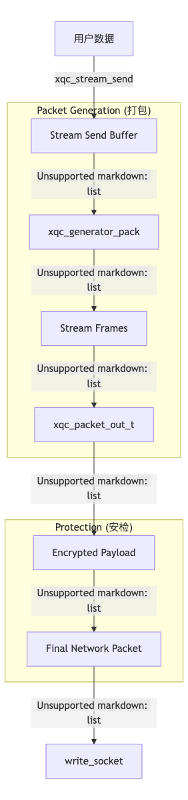
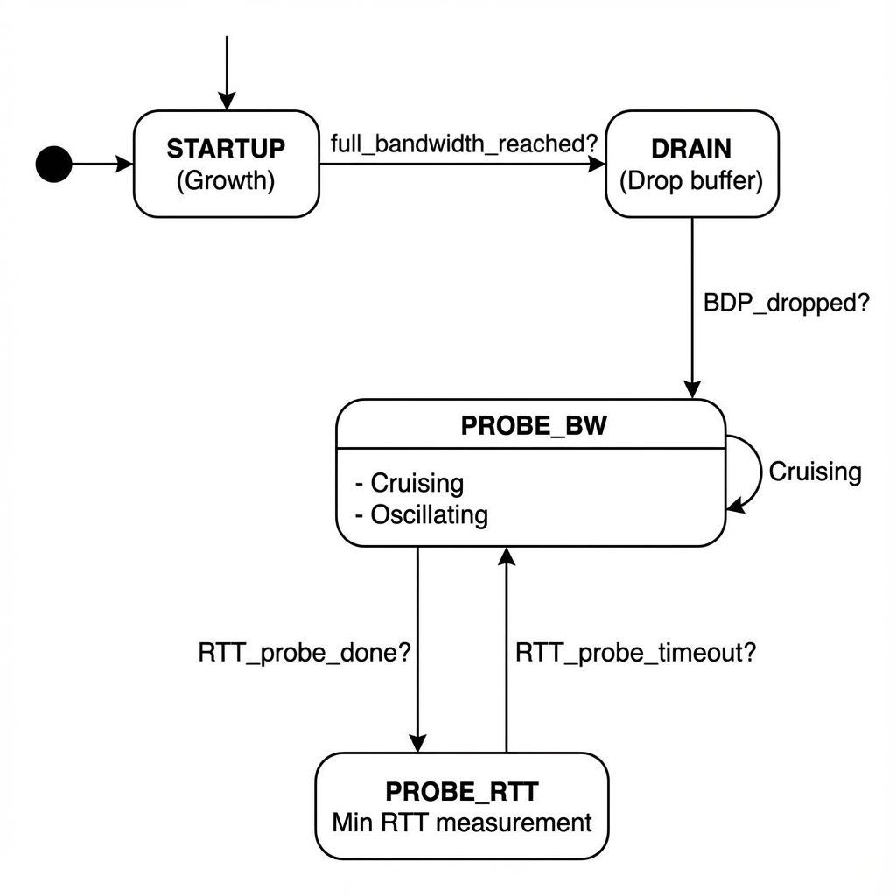

# XQUIC 源码深度剖析与实战指南

> **前言**: 本文档旨在为 XQUIC (Alibaba QUIC) 提供一份**全景式、深层次**的源码阅读指南。我们拒绝简单的代码罗列，而是采用**"物流系统"**的宏观类比，结合**微观的代码映射**，带你彻底理解这个高性能网络库的设计哲学与实现细节。

---

## �️ 宏观图谱：XQUIC 如同物流巨头

如果把 XQUIC 比作一家**跨国物流公司**：

1.  **Infrastructure (基建部)**: 负责公司的地基。
    *   **Engine**: 总调度中心，不睡觉，但只在闹钟响或有货到时工作。
    *   **Memory Pool**: 统一集装箱供应处，用完必须回收，不能乱扔。
    *   **Timer**: 巨大的任务排期表，精确到微秒。

2.  **Connection (运输车队)**:
    *   每条连接就是一辆**卡车**。
    *   TLS 握手是**安检与通行证办理**。
    *   Connection ID (CID) 是**车牌号**。

3.  **Stream (包裹管理)**:
    *   用户发的数据是**货物**。
    *   Stream 是**包裹**，负责把货物有序打包。
    *   Flow Control 是**仓库容量限制**。

4.  **Packet (集装箱运输)**:
    *   为了效率，多个包裹 (Stream Frames) 会被塞进一个**集装箱 (Packet)**。
    *   Dispatcher 是**分拣员**，看车牌号分货。

5.  **Congestion Control (路况中心)**:
    *   **SendCtl** 是副驾驶。
    *   **BBR/Cubic** 是路况算法，决定油门踩多深。

---

## 第一部分：基础设施 (The Infrastructure)

只有理解了地基，才能看懂高楼。XQUIC 的地基极具特色——**极致的无依赖与高性能**。

### 1. Engine：无我的调度中心

Engine 是上帝对象，但它极其“被动”。这就好比总调度中心**没有自己的司机**，全靠外部送人进来干活。

*   **核心类比**: Engine 是一个**事件处理的黑盒**。你给它网络包，它处理；你给它时间片，它驱动内部时钟。

#### 1.1 关键代码映射
| 逻辑点 | 源码位置 | 核心函数 | 说明 |
| :--- | :--- | :--- | :--- |
| **创建** | `src/transport/xqc_engine.c` | `xqc_engine_create` | 初始化 Hash 表，最小堆，保存回调。 |
| **收包入口** | `src/transport/xqc_engine.c` | `xqc_engine_packet_process` | 外部 `recvfrom` 后喂给 Engine。 |
| **时钟驱动** | `src/transport/xqc_engine.c` | `xqc_engine_main_logic` | 外部定时触发，处理超时和重传。 |

#### 1.2 核心调度流程 (`xqc_engine_main_logic`)
这是一个非常经典的**Reactor 变体**逻辑。



### 2. Memory Pool：零碎内存的克星

网络协议栈处理中充满了极小的对象（如 ACK Frame, Packet Info）。如果频繁 `malloc/free`，会造成严重的**内存碎片**和**性能损耗**。

*   **核心类比**: 不要每次寄快递都去买个新纸箱（malloc）。公司直接批发一大卷瓦楞纸（Block），按需裁剪（Palloc）。等这批货全发完了，整卷纸剩下的废料一起扔掉（Destroy Pool）。



#### 2.1 关键代码映射
| 逻辑点 | 源码位置 | 核心结构/函数 | 说明 |
| :--- | :--- | :--- | :--- |
| **结构体** | `src/common/xqc_memory_pool.h` | `xqc_memory_pool_t` | 维护 Block 链表。 |
| **分配** | `xqc_memory_pool.h` | `xqc_palloc` | 指针快速移动分配。 |
| **销毁** | `xqc_memory_pool.h` | `xqc_destroy_pool` | **一次性释放**所有 Block。 |

#### 2.2 深度细节：Block 增长策略
*   **小内存 (`size < pool->max`)**:
    *   检查当前 block 剩余空间 (`end - last`)。
    *   够用 -> 指针后移，返回地址。 (纳秒级耗时)
    *   不够 -> `malloc(4KB)` 挂载新 Block，再分配。
*   **大内存**: 直接 `malloc`，挂载到 `large_list`，销毁时一起 free。
*   **注意**: 这种机制**不支持释放单个对象**。内存生命周期必须与 Connection (或 Request) 绑定。这是空间换时间的典型权衡。

### 3. Timer：二叉堆上的时间舞者

上万个连接，每个都可以有不同的超时时间。如何快速找到“哪一个连接快超时了”？

*   **核心类比**: 就像医院的分诊台。挂号单按“预期就诊时间”排序。护士只看最上面那张单子（最小堆堆顶）。

#### 3.1 关键代码映射
| 逻辑点 | 源码位置 | 核心结构/函数 | 说明 |
| :--- | :--- | :--- | :--- |
| **数据结构** | `src/common/xqc_priority_q.h` | `xqc_priority_queue_t` | 基于数组的**最小二叉堆**。 |
| **时间基准** | `src/common/xqc_time.c` | `xqc_monotonic_timestamp` | 只能用单调时间，防改系统时间导致 bug。 |
| **所有者** | `src/transport/xqc_engine.h` | `conns_wait_wakeup_pq` | 全局共享一个堆，减少开销。 |

---

> **下文预告**: 我们将进入第二部分 **Part 2: Connection Lifecycle**。在这个部分，我们将看到一辆卡车是如何被制造出来（握手），如何挂牌上路（CID），以及遇到交警检查（Version Negotiation）的详细过程。


---

## 第二部分：连接生命周期 (Connection Lifecycle)

QUIC 的连接不同于 TCP 的四元组（IP:Port），它是由 **Connection ID (CID)** 标识的。这使得 QUIC 能够支持连接迁移（Wi-Fi 切 5G 不断连）。

### 5. Connection：卡车装配与上路

在 XQUIC 中，`xqc_connection_t` 是一切的核心。它维护了从握手开始到连接关闭的所有状态。

#### 5.1 状态机 (`xqc_conn_state_t`)
连接的状态流转比 TCP 复杂得多，主要在 `src/transport/xqc_conn.h` 中定义：




*   **INITIAL**: 刚创建，尚未交换密钥。
*   **HANDSHAKE**: 正在交换证书，使用 `Initial` 和 `Handshake` 包。
*   **ESTABLISHED**: 握手完成，可以愉快地发送应用数据 (`1-RTT`)。
*   **CLOSING / DRAINING**: 挥手阶段。`DRAINING` 指不再接收数据，只等队列清空或超时。

#### 5.2 握手流程 (Handshake)
XQUIC 的握手深度集成了 TLS 1.3。

*   **核心函数**: `xqc_conn_handshake_process` (`src/transport/xqc_conn.c`)
*   **流程解析**:
    1.  **Client**: 构造 `Initial Packet` (包含 ClientHello)，此时数据是明文的（除了头部混淆）。
    2.  **Server**: 收到 `Initial`，由于没有连接上下文，会先进入 `xqc_engine_packet_process` -> `xqc_server_accept`（创建新连接）。
    3.  **Key Derivation**: 一旦 ServerHello 发出，双方通过 `xqc_tls_process_handshake_data` 导出 `Handshake Key`。
    4.  **1-RTT**: 握手全部完成后，导出 `Application Key`，也就是我们说的 `1-RTT` 密钥，之后的应用数据都用它加密。

#### 5.3 连接 ID (CID) 管理
这是 QUIC 最神奇的地方。每个连接有一组 ID：
*   **SCID (Source CID)**: 我叫什么。
*   **DCID (Destination CID)**: 对方叫什么。

在 `xqc_conn_t` 中：
```c
struct xqc_connection_s {
    xqc_cid_t           scid_set[XQC_MAX_CID_COUNT]; // 我支持的 CID 列表
    xqc_cid_t           dcid_set[XQC_MAX_CID_COUNT]; // 对方支持的 CID 列表
    xqc_cid_t           *curr_dcid;                  // 当前发包用的目标 CID
};
```
当发生**连接迁移 (Migration)** 时（比如手机 IP 变了），客户端只需换一个新的 Source IP 发包，但保持 DCID 不变。Server 收到包后，根据 DCID 依然能找到内存里的同一个 `xqc_connection_t` 对象，从而实现**0-RTT 迁移**。

### 6. 关闭流程 (Closing)

QUIC 的关闭分为三种：
1.  **Idle Timeout**: 双方都不说话，直到 `xqc_timer_conn_idle_timeout` 触发。这是最常见的关闭方式。
    *   *代码*: `src/transport/xqc_timer.c`
2.  **Immediate Close (CONNECTION_CLOSE)**: 一方检测到协议错误（如解密失败），直接发 `CONNECTION_CLOSE` 帧，然后删除连接。
3.  **Stateless Reset**: 服务器重启了，失去了连接记忆。收到老包时，回复一个特殊的 Reset 包，含有一个 Token。

---

> **下文预告**: 连接建立后，数据包是如何在网络中穿梭的？Dispatcher 如何在千军万马中找到正确的连接？下一章 **Part 3: Packet Processing Pipeline** 将为你揭晓。

---

## 第三部分：数据包处理流水线 (Packet Processing Pipeline)

如果说 Connection 是卡车，那么 Packet 就是集装箱。这一章我们跟踪一个 UDP 包从网卡进入 XQUIC 内部的奇幻漂流。

### 7. 收包流程：拆解集装箱

入口发生在 `src/transport/xqc_engine.c` 的 `xqc_engine_packet_process`。

#### 7.1 第一关：CID 解析与分发 (Dispatcher)
QUIC 并不依赖 IP:Port 来路由，而是靠 CID。
*   **Packet Parser**: `xqc_packet_parse_cid` 首先从包头提取 Destination CID (DCID)。
*   **Conns Hash**: Engine 使用提取出的 DCID 在哈希表 (`engine->conns_hash`) 中查找对应的 `xqc_connection_t`。
    *   **Server 特殊逻辑**: 如果找不到，且包类型是 `Initial`，且长度足够，说明是一个新客户端的握手请求，创建一个新 Connection。

#### 7.2 第二关：头部解析与解密 (Decrypt)
找到 Connection 后，进入 `xqc_conn_process_packet` (`src/transport/xqc_conn.c`)。
QUIC 的头部是经过**头部保护 (Header Protection)** 的，Packet Number 均被加密。

1.  **Remove Header Protection**: 使用密钥（基于 Key Phase）解密头部，还原 Packet Number Length。
2.  **Decode Packet Number**: `xqc_packet_decode_packet_number`。
    *   QUIC 为了省流，Packet Number 是截断传输的（比如只传最后 2 位）。接收方需要根据自己收到的最大 PN 来推导完整的 PN。
3.  **Decrypt Payload**: `xqc_packet_decrypt`。使用 `AEAD` 算法解密整个 Payload。

#### 7.3 第三关：帧处理 (Frame Loop)
解密后的 Payload 是一串 **Frames**。`xqc_parse_frame` 会循环读取它们。

*   **STREAM Frame**: 数据包。交给 `xqc_process_stream_frame` -> 写入 Stream Recv Buffer。
*   **ACK Frame**: 确认包。交给 `xqc_process_ack_frame`。
    *   *Deep Dive*: XQUIC 使用 `xqc_recv_record_t` (`src/transport/xqc_recv_record.c`) 维护 **ACK Ranges**。它本质上是一个链表，记录了所有收到的包序号区间 (e.g., `[1-100], [105-200]`)。中间的空洞 (`101-104`) 即为丢包，SendCtl 会据此触发重传。
*   **CRYPTO Frame**: 握手数据。交给 TLS 上下文处理。

### 8. 发包流程：组装集装箱 (Data Flow)

出口在 `xqc_conn_transmit_packet`。



#### 8.1 打包策略 (Packetization)
*   **Generator**: `xqc_generator_pack` 是打包工。它会询问：
    *   "有 ACK 要回吗？" -> 塞入 ACK Frame。
    *   "有流数据要发吗？" -> 遍历 `active_streams`，塞入 STREAM Frame。
    *   "还剩多少空间？" -> 还能塞点别的（如 PATH_CHALLENGE）。

#### 8.2 加密与发送
1.  **Encrypt**: 对 Payload 进行 AEAD 加密。
2.  **Header Protection**: 对头部采样并进行异或混淆。
3.  **Callback**: 调用 `write_socket` 回调发给网卡。

---

> **下文预告**: 集装箱拆开后，里面的包裹（Stream Data）是如何被有序交付给应用的？Flow Control 是如何避免爆仓的？下一章 **Part 4: Stream Management** 继续深入。

---

## 第四部分：流与数据管理 (Stream & Data Flow)

QUIC 是多路复用 (Multiplexing) 协议。Stream 是应用层看到的数据通道，而 Packet 只是底层的运输载体。

### 9. Stream：邮包与乱序重组

#### 9.1 数据结构映射
*   **发送端 (`xqc_stream_write_buff_list_t`)**: 如果发送窗口满了，或者 0-RTT 失败了，数据会被暂存在这里。一有机会（收到 WINDOW_UPDATE 或 握手完成），Engine 会遍历所有有缓冲的 Stream 继续发送。
*   **接收端 (`xqc_stream_data_in_s`)**: 这里的核心是 `frames_tailq`。
    *   **乱序处理**: 这是一个按 `offset` 排序的链表。收到一个 Packet，解析出 Stream Frame 后，会根据 offset 插入链表的正确位置。如果 offset 刚好填补了之前的空洞，就会触发 `merged_offset_end` 推进，通知应用层 "有新数据可读"。

#### 9.2 状态机
Stream 的状态机独立于 Connection。
*   **Idle** -> **Open**: 第一次发送/接收数据。
*   **Half-Closed (Local/Remote)**: 一方发了 FIN。
*   **Closed**: 双方都发了 FIN 且收到确认。

### 10. Flow Control：仓库管理员

QUIC 的流控 (Flow Control) 是为了防止接收端缓冲区溢出。它是一套严格的**借贷 (Credit) 系统**。

#### 10.1 双层流控机制
XQUIC 在 `xqc_stream_do_send_flow_ctl` 中执行严格检查：

1.  **Connection Level (`MAX_DATA`)**:
    *   整辆卡车的总载货量。限制该连接上所有 Stream 发送字节数之和。
2.  **Stream Level (`MAX_STREAM_DATA`)**:
    *   单个包裹的最大体积。限制单条 Stream 的发送量。

#### 10.2 阻塞与更新
*   **阻塞**: 当发送量达到上限，函数返回 `-XQC_ESTREAM_BLOCKED`。XQUIC 会自动发出 `DATA_BLOCKED` 帧，以此“抗议”："我想发数据，但额度不够了！"
*   **更新**: 接收端应用层读走数据后，Buffer 腾出空间，XQUIC 发送 `WINDOW_UPDATE` (即 `MAX_STREAM_DATA` 帧)，通知发送端："仓库空了，可以继续发货了"。

---

> **下文预告**: 货物都装好了，车也发动了，但油门该踩多深？路堵不堵？最后一部分 **Part 5: Congestion Control** 将带你领略 BBR 与 Cubic 的智慧。

---

## 第五部分：拥塞控制与恢复 (Congestion Control & Recovery)

如果说 Flow Control 是防止“爆仓”，那 Congestion Control 就是防止“堵车”。

### 11. SendCtl：副驾驶

`xqc_send_ctl_t` (`src/transport/xqc_send_ctl.c`) 是专门管理发送逻辑的模块。它不关心包里装的是什么，只关心：
1.  这个包什么时候发的？
2.  这个包丢了吗？
3.  现在网速多少？

#### 11.1 丢包检测 (Loss Detection)
XQUIC 采用了基于 RTT 的丢包检测，而非简单的 3-ACK 重复。
*   **Packet Threshold**: 如果 `Packet N` 被 ACK 了，那么 `Packet N - k` 还没到，就认为 `N-k` 丢了。
*   **Time Threshold**: 如果 `Packet N` 发出去超过 `1.125 * RTT` 还没回音，认为丢了。
*   **PTO (Probe Timeout)**: 如果太久没收到任何 ACK，触发 PTO，发一个探测包去“戳一下”服务器。

### 12. BBR：智能导航算法

XQUIC 默认支持 Cubic 和 BBR v1/v2。算法逻辑封装在 `xqc_cong_ctrl_callback_t` 接口中。

#### 12.1 BBR 状态机 (`src/congestion_control/xqc_bbr.c`)
BBR 不像 Cubic 那样盲目抢占带宽，而是由 4 个状态驱动：



1.  **Startup (起步猛踩)**: 指数级增加发送速率，探测最大带宽 (Max BW)。
2.  **Drain (排空)**: 发现 RTT 变大了（排队了），刹车，把队列里的水放掉。
3.  **ProbeBW (巡航)**: 在最大带宽附近波动探测，保持高吞吐。
4.  **ProbeRTT (测距)**: 每 10 秒钟，几乎停止发送 (只发 4 个包)，为了测得纯净的最小 RTT。

#### 12.2 Pacing (平滑发送)
XQUIC 极其重视 Pacing。
*   **问题**: 如果一有窗口就瞬间发出一大波包 (Burst)，会导致路由器 buffer 溢出。
*   **解决**: `xqc_pacing.c` 依据 BBR 计算出的 Rate，像**漏桶**一样均匀地把包发出去。Engine 的 Loop 会计算 "发下一个包还要睡多久"，设置定时器，微秒级精确控制。

---


---

## 第六部分：进阶特性 (Advanced Features)

XQUIC 不仅实现了标准 QUIC，还在高性能和移动端场景下做了大量增强。

### 13. Multipath QUIC (多路径)

XQUIC 支持多路径传输 (MPQUIC)，允许一个连接同时使用 Wi-Fi 和 5G，或者在它们之间无缝切换。

*   **核心结构**: `xqc_path_ctx_t` (`src/transport/xqc_multipath.c`)。
*   **多径原理**:
    *   每个连接 (`xqc_connection_t`) 维护一个 `paths_list`。
    *   原本的 `SendCtl` 和 `Congestion Control` 是绑定在 **Path** 维度上的，而不是 Connection 维度。这意味着 Wifi 和 5G 各自维护一套 RTT 和拥塞窗口，互不干扰。
    *   **Packet Scheduler**: 决定下一个包发给哪条路径（默认 Min-RTT 策略）。

### 14. 高性能优化 (Optimization)

#### 14.1 批量发送 (Batch Sending)
系统调用 (`sendto`) 的开销是巨大的。XQUIC 支持 `sendmmsg`，一次系统调用发送多个包。
*   **开关**: `engine_config->sendmmsg_on`。
*   **回调**: 使用 `xqc_transport_callbacks_t` 中的 `write_mmsg` 替代普通的 `write_socket`。

#### 14.2 0-RTT 握手
XQUIC 完善支持 0-RTT。
*   **原理**: 客户端缓存 ServerConfig (Token)，再次连接时，直接在 Initial 包之后紧跟 0-RTT 数据包，无需等待握手完成。
*   **风险**: 0-RTT 数据可能被重放攻击，应用层需幂等处理。

---

## 🏁 结语：如何阅读源码

XQUIC 是一个工业级的 C 语言项目，代码量大但结构清晰。
*   **初学者**: 从 `xqc_engine_main_logic` 看起，抓住事件驱动的主轴。
*   **进阶**: 关注 `xqc_stream.c` 的状态流转，理解流控的数学逻辑。
*   **高阶**: 深入 `xqc_bbr.c` 和 `xqc_packet_parser.c`，研究算法调优和位操作技巧。

希望这份笔记能成为你探索 XQUIC 的地图！

