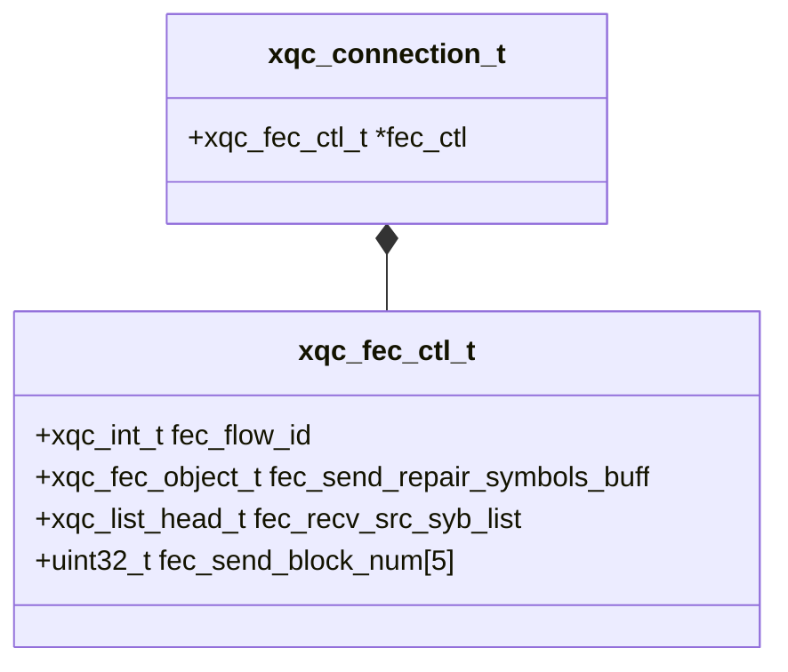
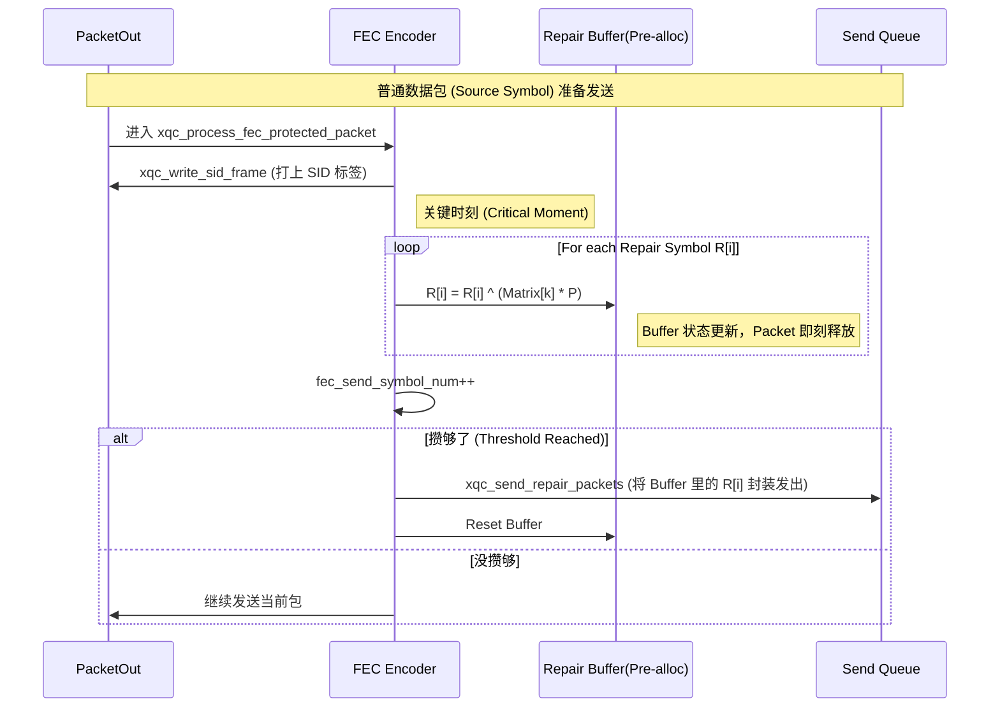

# XQUIC FEC 源码深度剖析 (Atomic Level)

> **警告**: 本文档深入源代码的"原子层级"。我们不再使用模糊的类比，而是直接解剖 `struct` 的内存布局和指针流向。

---

## Part 1: 数据结构解剖学 (Data Structure Anatomy)

一切的核心在于 `src/transport/xqc_fec.h`。这是 FEC 的基因图谱。

### 1. 核心控制器: `xqc_fec_ctl_t`

每个开启了 FEC 的 Connection 对象 (`xqc_connection_t`) 都会持有一个 `xqc_fec_ctl_t` 指针。它不是一个简单的状态机，而是一个复杂的**双向缓冲区管理器**。



#### 关键字段解析

1.  **Block Mode Arrays (`[XQC_BLOCK_MODE_LEN]`)**:
    *   XQUIC 支持同时运行多种 FEC Block 模式（虽然通常只用一种）。
    *   `fec_send_symbol_num[mode]`: 这是一个计数器。每当 `xqc_fec_encoder` 成功处理一个 Source Packet，这个值 +1。
    *   `fec_send_required_repair_num[mode]`: "目标值"。系统计算出当前 Block 需要生成几个 Repair Packet。

2.  **Repair Buffer (`fec_send_repair_symbols_buff`)**:
    *   **定义**: `xqc_fec_object_t [5][10]`。
    *   **内存布局**: 这是一个二维数组。第一维是 Block Mode，第二维是 Repair Symbol Index。
    *   **作用**: 这是**增量计算**的暂存区。当第一个 Source Packet 到达时，它被 XOR/Galois 乘法进这个 buffer。当 Source Packet 发送走后，内存被释放，但它的"影子"留在了这个 buffer 里。

### 2. 通用对象: `xqc_fec_object_t`

这是 XQUIC 为了统一管理 Source 和 Repair 数据而抽象出的"容器"。

```c
typedef struct xqc_fec_object_s {
    size_t                       payload_size; // 实际数据长度
    xqc_int_t                    is_valid;     // 1: 有效, 0: 空闲/无效
    unsigned char               *payload;      // 指向堆内存 (xqc_malloc)
} xqc_fec_object_t;
```

*   **is_valid**: 这是一个极其重要的标志位。在编码过程中，如果某个 Repair Symbol 不需要生成（比如丢包率极低，只要 1 个冗余），对应的 `is_valid` 会被设为 0，避免无谓的计算。

### 3. 接收端链表 (`xqc_fec_src_syb_t`)

接收端无法预知包的到达顺序，因此使用了**双向链表** (`xqc_list_head_t`) 来管理乱序到达的碎片。

*   `fec_recv_src_syb_list`: 存放**收到**的 Source Packet。
*   `fec_recv_rpr_syb_list`: 存放**收到**的 Repair Packet。

> **Design Note**: 这里没有使用数组，而是链表。因为在丢包场景下，Block ID 可能是跳跃的，链表能更灵活地插入和删除过期的 Block 数据。

---

---

## Part 2: 谈判状态机 (Negotiation State Machine)

FEC 不是默认开启的，它必须经过严谨的 "Offer-Answer" 握手。

### 1. 握手逻辑 (`xqc_negotiate_fec_schemes`)

**源码位置**: `src/transport/xqc_fec.c:850`

整个协商过程发生在 `ClientHello` 和 `ServerHello` (Encrypted Extensions) 阶段。

#### 1.1 核心流程
1.  **Transport Parameter Check**: 首先检查 `params.fec_version`。如果版本不匹配 (比如对方是旧版 v1)，置位 `XQC_OLD_FEC_VERSION` 并直接返回。
2.  **Encoder Negotiation**:
    *   **场景**: 本地开启了 `enable_encode_fec`，且对方开启了 `enable_decode_fec`。
    *   **动作**: 调用 `xqc_set_final_scheme`，从对方支持的解码列表和自己支持的编码列表中，找到优先级最高的交集。
    *   **关键点**: 如果你是 Client，Server 必须只选定**一种**方案。如果 Server 返回了多个，Client 会报错 `XQC_CLIENT_RECEIVE_INV_DEC`。
3.  **Callback Binding**:
    *   协商成功后，最关键的一步是 `xqc_set_valid_encoder_scheme_cb`。
    *   它将 `conn->conn_settings.fec_callback` 中的函数指针（init, encode, decode）指向具体的实现算法（如 `xqc_reed_solomon_code_cb`）。

### 2. 失败原因代码表 (`xqc_fec_neg_fail_reason_e`)

XQUIC 定义了一组详细的 flag 来记录协商为何失败，这对 debug 非常有用。

| Flag | 值 | 含义 |
| :--- | :--- | :--- |
| `XQC_LOCAL_NOT_SUPPORT_ENC` | `1<<0` | 本地没开编码 |
| `XQC_NO_COMMON_FEC_ENC` | `1<<4` | 没找到公共算法 (如我只懂 RS，你只懂 XOR) |
| `XQC_CLIENT_RECEIVE_INV_DEC` | `1<<8` | Client 收到 Server 发来的非法参数 (Server 必须选定唯一方案) |

---

---

## Part 3: 编码流水线 (Encoder Assembly Line)

这是数据包离开前的最后一道工序。

### 1. 增量计算模型

XQUIC 为了极致的内存效率，**没有**先把 10 个包缓存下来再统一计算。而是采用了**流式增量计算**。

**入口**: `xqc_process_fec_protected_packet` (Line 372)

#### 1.1 核心释疑：为什么是"流式增量"？ (Why Incremental?)
很多开发者会误以为 FEC 是 "攒够 10 个包，暂停发送，计算，再恢复发送"。
**错！XQUIC 绝不暂停。** 

*   **Critical Moment (关键时刻)**: 指的是每个 Packet 经过 Encoder 的那一瞬间。
*   **Action**: 
    1.  Packet 内容与 Buffer 里的数据进行 XOR/Galois 运算。
    2.  算完**立刻**发走 Packet，不占用发送队列的任何时间。
    3.  内存里只保留运算结果（Buffer），**不保留**原始 Packet 的副本。
    
> **类比**: 就像你往存钱罐里丢硬币。每次丢进去（计算），存钱罐的总金额（Buffer）就变了。你不需要记住之前丢进去的每一枚硬币长什么样，你只需要知道现在的总金额是多少。

#### 1.2 视觉图解：流式计算



#### 2. 代码细节深度 (Atomic Detail)

1.  **打标签 (`xqc_write_sid_frame_to_one_packet`)**:
    *   在编码**之前**，必须先往 Packet 里塞一个 `SID Frame`。
    *   **为什么？**: 因为接收端必须知道"这是 Block 5 的第 3 个包"。如果不塞这个 Frame，接收端就只能瞎猜，这在丢包场景下是不可接受的。
2.  **符号累积 (`xqc_fec_encoder`)**:
    *   这个函数并没有"生成"新的包，它只是更新了 `fec_send_repair_symbols_buff` 的内存状态。
    *   `src/transport/fec_schemes/xqc_reed_solomon.c:140`: `xqc_rs_code_one_symbol`。
    *   它将当前的 Packet Payload 作为输入，遍历所有的 Repair Key，计算出对每个冗余包的"贡献分量"，并累加进去。
3.  **触发阈值 (`max_src_symbol_num`)**:
    *   Line 382: `xqc_get_fec_blk_size`.
    *   Line 412: `if (conn->fec_ctl->fec_send_symbol_num == max_src_symbol_num)`.
    *   只有当计数器完全等于 Block Size 时，才会触发 `xqc_send_repair_packets`。这保证了冗余包是在整个 Block 的所有信息都"吸收"完毕后才发出的。

---

---

## Part 4: 运送保险单 (The Shipment)

当 Encoder 攒够了冗余数据，就需要把它们打包发出去。

### 1. 维修包生成 (`xqc_write_repair_packets`)

**源码位置**: `src/transport/xqc_packet_out.c:496`

这是一个批量操作。如果 Block Size = 10, Code Rate = 0.8，那么这里会一次性循环生成 2 个 Repair Packet。

#### 1.1 优先级插队 (Critical!)

注意第 518 行的 `xqc_send_queue_move_to_head`：

```c
xqc_send_queue_move_to_head(&packet_out->po_list, prev);
```

**为什么？**:
FEC 只有和原始数据一起到达才有意义。如果维修包积压在发送队列末尾，等到它发出去时，接收端可能早就因为超时而放弃这个 Block 了。
因此，XQUIC 强制将生成的维修包**插入到发送队列的最前端**，紧挨着刚才那个触发了阈值的 Source Packet 之后。

### 2. Header 构造 (`xqc_gen_repair_frame`)

维修包里装的是什么？
它是一个标准的 QUIC Short Header Packet，但里面唯一的 Frame 是 **REPAIR_FRAME**。

*   **Payload**: 就是 `fec_send_repair_symbols_buff` 里那串经过异或运算的二进制（我们称之为 "Accumulated Value" 或 "Repair Symbol"）。
*   **Metadata**: 包含 Block ID (告诉接收端这是哪一批货) 和 Symbol Index (这是第几个保险单)以及 Repair Key。
*   **定义澄清**: Repair Packet 只是**修补材料**（保险单），它本身**不是**被修复的数据包。客户端用它配合收到的其他包，经过数学计算，才能"变"出丢失的包。

---

---

## Part 5: 拼图恢复 (Decoder Recovery)

接收端的任务是不断尝试拼图，直到凑齐碎片。

### 1. 触发时机 (`xqc_try_process_fec_decode`)

**源码位置**: `src/transport/xqc_frame_parser.c:597` (你没看错，它在 frame_parser 里)

每当收到一个 **SID Frame** 或 **REPAIR Frame**，解析器都会调用这个函数尝试一次解码。

#### 1.1 恢复条件

```c
if (recv_src_num + recv_rpr_num >= max_src_symbol_num) {
    // 启动解码！
}
```
*   `recv_src_num`: 收到的原始包数量。
*   `recv_rpr_num`: 收到的冗余包数量。
*   `max_src_symbol_num`: Block 的总大小 (e.g. 10)。

只要两者之和达到 10，就意味着我们拥有了 10 个方程，足以解出 10 个未知数（利用 Reed-Solomon 的 MDS 性质）。

### 2. 恢复实施 (`xqc_fec_bc_decoder`)

如果条件满足，且确实有丢包 (`recv_src_num < max`)，则调用 `xqc_fec_bc_decoder`。
1.  **构建矩阵**: 挑选出对应的 Vandermonde 行。
2.  **求逆与乘法**: 算出丢失的 Source Packet。
3.  **注入**: 恢复出的 Packet 会被当作"刚收到"一样，注入给 QUIC 引擎。

--- 

---

## Part 6: 数学核心 (The Mathematical Core)

XQUIC 的 Reed-Solomon 实现位于 `src/transport/fec_schemes/xqc_reed_solomon.c`。它是基于 **GF(2^8)** 伽罗瓦域的运算。

### 1. 为什么是 GF(2^8)?

*   **Byte-Aligned**: GF(2^8) 的元素正好对应一个字节 (0-255)。这使得所有的矩阵运算都可以对应到具体的内存字节操作。
*   **Table Lookup**: 在 GF(2^8) 中，加法 = XOR（异或）。乘法比较复杂，但 XQUIC 预计算了 **Look-up Table**，将乘法转换为了查表操作 (`xqc_galois_calculation.h`)，极大地加速了计算。

### 2. 生成矩阵 (Generator Matrix)

*   **Vandermonde Matrix**: XQUIC 使用范德蒙矩阵作为编码矩阵的基础。
*   `xqc_build_generator_matrix`:
    *   这个函数构造了一个 `(N + M) x N` 的矩阵。
    *   前 N 行是 **单位矩阵 Identity Matrix** (保证 Source Symbol 发送原样数据)。
    *   后 M 行是 **Vandermonde Matrix** (用于生成 Repair Symbol)。

### 3. 求逆与解码 (`xqc_gen_invert_GM`)

当数据丢失时，我们需要解方程组 `y = A * x`。
1.  **Selection**: 根据收到的 Symbol ID，从原来的 `(N+M) x N` 矩阵中挑出对应的行，组成一个新的 `N x N` 矩阵 `A'`。
2.  **Inversion**: 计算 `A'` 的逆矩阵 `A'^-1`。
3.  **Multiply**: `x = A'^-1 * y`。

这一步就是 `xqc_fec_bc_decoder` 里的核心逻辑。

### 4. 常见疑问澄清 (Common Confusion)

#### 4.1 XOR 还是 Galois?
XQUIC 支持两种模式，原理不同但目标一致：
*   **XOR (异或)**: 最简单。$A \oplus B = R$。如果 $A$ 丢了，用 $B \oplus R$ 就能算回 $A$。计算极快，但恢复能力有限（通常用于简单的 1-loss 恢复）。
*   **Reed-Solomon (Galois)**: 强大但复杂。利用矩阵运算。$Packets \times Matrix = Repair$。只要丢失数量在容忍范围内，任意丢失都能恢复。XQUIC 的默认实现是这个。

#### 4.2 阈值 (Threshold) 与 (N, K)
在 FEC 术语中，通常用 $(N, K)$ 表示：
*   $K$: **Source Symbols** (原始数据包数量)。这就是代码中的 `max_src_symbol_num`（阈值）。
*   $R$: **Repair Symbols** (冗余包数量)。
*   $N$: Total Symbols ($N = K + R$)。

**阈值的作用**:
Encoder 里的计数器 `fec_send_symbol_num` 实际上就是在数 $K$。
当数到 $K$ 时，说明这一组原始数据（Block）发完了，必须立刻把算好的 $R$ 个 Repair Packets 发出去，否则这一组的保护就没法闭环。

### 5. 进阶问答 (Advanced FAQ)

#### 5.1 Repair Packet 是放在 Block 最前面吗？
**不是**。这是直觉上的误区。
*   **生成时机**: 必须等 Block 里的所有 K 个 Source Packet 都处理完，才能算出 Repair Packet。所以物理上，Repair 是在 Source **之后**生成的。
*   **发送位置**: 代码 `xqc_send_queue_move_to_head` 的参数 `head` 实际上是前一个包的指针 (`prev`)。
    *   效果: 将 Repair Packet 插入到**刚刚触发阈值的那个 Source Packet 后面**。
    *   目的: 让它们"紧贴"着 Source Block 发送，即使发送队列里还有其他无关数据包，FEC 也会"插队"到最前面发送，确保低延迟。

#### 5.2 为什么 header 必须带 Block ID？
有两层原因：
1.  **UDP 乱序**: 网络不是导管，是弹珠机。包到达顺序可能是 `#3, Repair1, #1, #2...`。如果没有 ID，接收端不知道 `Repair1` 是修补哪一组的。
2.  **多流复用 (Multiplexing)**: 一个 QUIC 连接可能有 100 个 Stream 同时在发。Block 100 可能属于 Stream 1，Block 200 属于 Stream 2。如果没有 ID，接收端完全无法将 Repair Packet 归位。

#### 5.3 Symbol Index 是干嘛的？
它的作用是告诉接收方：**"我是这一组方程里的第几行"**。
*   Source Packet 的 Index 是 $0$ 到 $K-1$。
*   Repair Packet 的 Index 是 $0$ 到 $R-1$。
*   解码矩阵需要根据这个 Index 来选取对应的 **Vandermonde 行**。

#### 5.4 XOR, Galois, RS 到底是什么关系？
*   **Reed-Solomon (RS)**: 是**算法**的名字 (Algorithm)。就像 "快速排序"。
*   **Galois Field (GF)**: 是 RS 算法依赖的**数学域** (Math Domain)。就像 "整数运算"。
*   **XOR**: 是 GF 域中的**加法运算** (Operation)。
    *   在 RS 算法里，矩阵乘法 $= \sum (A \times B)$。
    *   在 GF(2^8) 里，这个 $\sum$ (加法) 就是 **XOR**。
    *   所以：**RS 算法 = 在 Galois 域上，用 XOR 做加法，用查表做乘法**。

#### 5.5 恢复出的包会被"发送"出去吗？
**绝对不会**。这是对"注入"一词的误解。
*   **消费流程**: 恢复出的 Source Packet 会被放入接收队列 (`fec_recv_src_syb_list`)。
*   **注入引擎**: FEC 模块会欺骗 QUIC 核心引擎："嘿，我刚才从网络上收到了这个包（其实是算出来的），请按照正常流程处理它（解密、重组 Stream、通知应用层）"。
*   **不转发**: 它是给**自己**消费的，用来弥补丢失的数据，绝不会再次通过网络发送给别人。它是终点，不是中继。

#### 5.6 为什么接收端也需要 QUIC Engine？
**是的，Engine 是双向的核心。**
*   **发送端 Engine**: 负责打包、拥塞控制、重传定时器。
*   **接收端 Engine**: 负责解密 (TLS)、去重 (Packet Number Check)、流重组 (Stream Reassembly)、流控 (Flow Control)。
*   **FEC 的作用**: 它就像一个"外挂"。当 Engine 发现丢包时，FEC 这个外挂计算出丢的包，然后**手把手**塞回给 Engine："给，这是你以为丢了的包，其实我帮你找回来了，你继续处理吧。"

#### 5.7 恢复后具体放在哪？(The Reassembly Buffer)
您的直觉非常准："是不是有一个 buffer，恢复出来插进去？"
**是的，这个 Buffer 叫做 `Stream Frame List`**。
*   **正常流程**: 收到的包（1, 2, 4, 5）会被放入 Stream 的重组链表中，留下空洞（Missing 3）。
*   **恢复流程**: 
    1.  FEC 算出 Packet 3 的 Payload。
    2.  调用 `xqc_process_recovered_packet`。
    3.  这个函数会把 Payload 伪装成一个 Packet，丢给 `xqc_process_frames`。
    4.  QUIC 引擎解析出里面的 STREAM_FRAME，发现是 Offset 3，正好填补了链表里的空洞。
    5.  Buffer 连续了，应用层（如 HTTP）就能读到完整数据了。

---

## 结语：如何看懂这 2000 行代码？

XQUIC 的 FEC 模块是工程与数学的完美结合。如果你想彻底掌握它，建议按照以下顺序阅读源码：

1.  **Headers First**: 先看 `xqc_fec.h`，对着本文的 [Part 1] 把内存结构背下来。
2.  **State Machine**: 看 `xqc_fec.c` 里的 `xqc_negotiate_fec_schemes`，理解开关是怎么打开的。
3.  **Data Flow**: 跟踪 `xqc_process_fec_protected_packet` (Send) 和 `xqc_try_process_fec_decode` (Recv)，理解数据如何在 Buffer 之间流转。
4.  **The Math**: 最后再看 `xqc_reed_solomon.c`，去抠那些矩阵运算的细节。

**最终总结**:
> FEC 是 XQUIC 对抗弱网环境的终极武器。它用 **CPU 时间** 和 **带宽空间** 换取了 **低延迟时间**。在实时音视频 (RTC) 场景下，这笔交易是绝对划算的。

---

## Nano-Level Part 1: 内存这一生 (Memory Lifecycle)

我们不仅关注数据流，更关注内存流。XQUIC 在 FEC 上的内存管理极其克制。

### 1. 符号池机制 (`fec_free_list`)

FEC 运算涉及大量临时 Block 的创建和销毁。如果频繁 `malloc/free`，碎片化会极其严重。

*   **出生**: `xqc_new_src_symbol` (Line 1090)
    *   优先从 `fec_free_src_list` 中复用旧对象。
    *   只有当池子空了，才调用 `xqc_create_src_symbol` -> `xqc_calloc`。
*   **消亡**: `xqc_fec_ctl_init_recv_params`
    *   当一个 Block 成功解码或超时失效后，它的所有 Symbol **不会被 free**。
    *   它们被挂回 `fec_free_src_list`，等待下一次轮回。

> **Performance Tip**: 在高并发场景下，这个 Pool 的大小决定了 FEC 的内存开销上限。如果发现内存暴涨，检查 Recv List 是否有大量积压的无法解码的 Block。

---

## Nano-Level Part 2: 数学内核 (The Math Kernel)

让我们把显微镜对准 `xqc_galois_multiply(a, b)`。

### 1. 为什么快？

在 GF(2^8) 中，乘法 `a * b` 原本需要多项式模运算，非常慢。XQUIC 利用对数原理：
$$ a \times b = \exp(\log(a) + \log(b)) $$

这意味着乘法被转化为了 **3 次查表 + 1 次加法**。

**源码位置**: `src/transport/fec_schemes/xqc_galois_calculation.c:11`

```c
unsigned char xqc_galois_multiply(unsigned char a, unsigned char b)
{
    if (a == 0 || b == 0) return 0;
    // 1. 查 Log 表
    unsigned char log_a = xqc_rs_log_table[a];
    unsigned char log_b = xqc_rs_log_table[b];
    // 2. 查 Exp 表 (注意 log_a + log_b 可能溢出 255，Exp 表通常做成 512 大小以避免取模)
    return xqc_rs_exp_table[log_a + log_b];
}
```

### 2. 生成范德蒙矩阵 (`xqc_build_vandermonde_matrix`)

每一行代表一个 Repair Symbol。第 `i` 行的第 `j` 列元素为：
$$ M_{i,j} = i^j $$
在代码中对应 `xqc_galois_exp(i, j)`。

正是这个特殊的矩阵结构，保证了任意切下来的 `N` 行组成的子矩阵都是**可逆的**。这就是 Reed-Solomon 能恢复数据的数学基石。

---

---

## Nano-Level Part 3: 与拥塞控制的博弈 (The CC Economy)

很多人认为 "FEC 就是发更多的包，会加剧拥塞"。XQUIC 是如何处理这个矛盾的？

### 1. 并没有 "免费" 的带宽

`xqc_send_repair_packets` 生成的 Repair Packet，最终会走到 `xqc_write_packet`。
在 `xqc_send_ctl.c` 的 `xqc_send_packet_check_cc` 中：

```c
// xqc_send_ctl.c
if (send_ctl->ctl_bytes_in_flight + packet_out->po_used_size > congestion_window) {
    can = 0; // 被拥塞控制拦截！
}
```

这意味着：**Repair Packet 是要消耗 CWND 的**。
如果网络已经严重拥塞（CWND 很小），XQUIC 会**优先发送重传数据**（Retransmission），而 Repair Packet 可能会被阻塞甚至丢弃。

### 2. "插队" 策略 (`xqc_send_queue_move_to_head`)

虽然要排队，但 Repair Packet 有特权。
一旦生成，它会被插入到 `sndq_send_packets` 的**头部**。

*   **设计意图**: Repair Packet 的有效性随时间衰减。如果它排在长长的普通数据包后面，等轮到它发的时候，Receiver 可能早就超时重传了。
*   **代价**: 这会稍微增加普通数据包的 RTT 抖动，但对于抗丢包是必要的。

---

## Nano-Level Part 4: 动态自适应 (Adaptive Features)

XQUIC 的 FEC 不是静态的。它支持**根据流的状态动态调整**。

### 1. 动态自适应 (`xqc_fec_on_stream_size_changed`)

在 `xqc_fec.c` 中，我们发现了这个函数：

```c
void xqc_fec_on_stream_size_changed(xqc_stream_t *quic_stream) {
    // ...
    // 根据 bitrate_allocator 计算出的新码率
    fec_code_rate = conn->conn_settings.fec_params.fec_code_rate;
    // 重新计算需要的 repair symbol 数量
    rpr_syb_num = xqc_get_fec_rpr_num(fec_code_rate, src_syb_num);
    // ...
    // 如果参数变了，重置 FEC 编码器参数
    if (...) {
         conn->conn_settings.fec_callback.xqc_fec_init_one(conn, 0);
    }
}
```

这意味着 XQUIC 可以根据网络状况（如带宽估算 BBR）**实时调整冗余度**。网络好时由 50% 冗余降到 10%，节省流量；网络差时瞬间拉升，保驾护航。

### 2. 多路径支持 (Multipath FEC)

虽然代码中引用了 `xqc_fec_mp_mode`，但目前的实现主要集中在单路径。在多路径场景下，Symbol 可能会乱序到达，这对 `fec_recv_window` 的管理提出了巨大挑战。目前的策略倾向于在**各自路径**上独立进行 FEC 保护，或者在主路径上通过 FEC 保护所有路径的丢包（视具体配置而定）。

---
