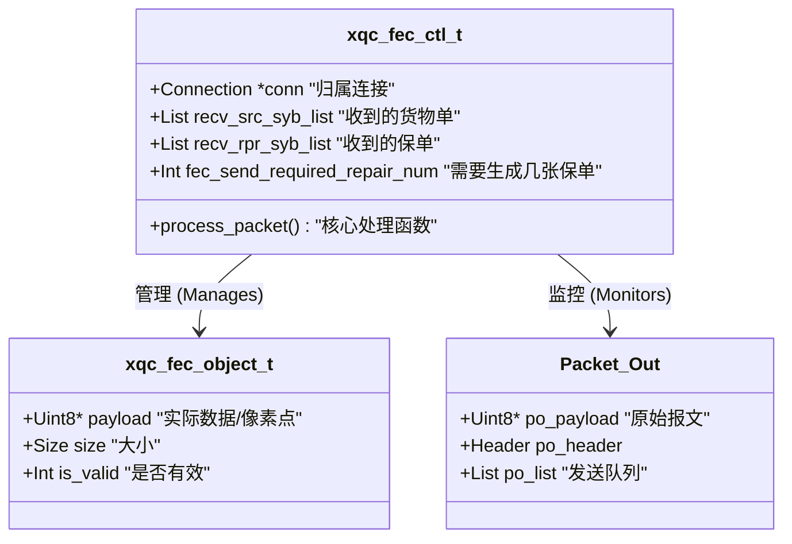
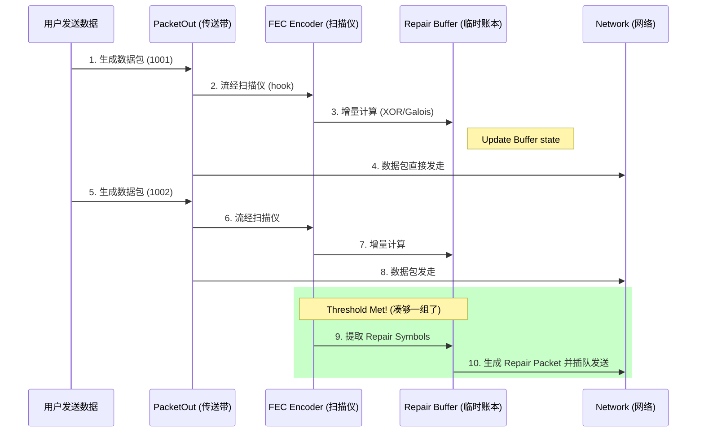
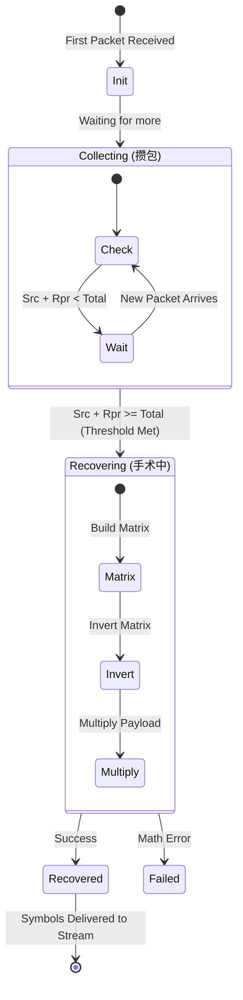

# Deep Dive: XQUIC FEC (The Visual & Narrative Edition)

> **核心隐喻 (Core Metaphor)**: 整个 FEC 模块就像一个 **"保险物流中心" (Insurance & Logistics Hub)**。
> *   **Source Packet**: 贵重货物。
> *   **Repair Packet**: 保单/保险箱。
> *   **Encoder**: 打包流水线，负责给货物拍照留底，生成保单。
> *   **Decoder**: 理赔修复中心，当货物丢失时，用保单和残存货物还原出原件。

---

## Part 1: 解剖室 —— 数据的骨架 (The Anatomy)

### 1.1 隐喻：仓库管理员的一本账 (`xqc_fec_ctl_t`)

如果不看代码，我们先想象一个仓库管理员需要记什么账？
*   **"我发了多少货？"** -> `fec_send_symbol_num`
*   **"我开了多少保单？"** -> `fec_send_repair_num`
*   **"对方收到了吗？"** -> `fec_flow_inflight` (流控)

在 `xqc_fec.h` 中，`xqc_fec_ctl_t` 就是这个管理员。

### 1.2 视觉图解：核心数据结构 (The Map)

### 1.3 逻辑链：内存是怎么分配的？

> **Data Chain**: `Malloc` -> `Pool` -> `Use` -> `Recycle`

1.  **Init**: 连接建立时，`xqc_fec_ctl_create` 向系统申请一大块内存，建立 "空箱子池" (`fec_free_src_list`)。
2.  **Acquire**: 当收到一个包，用 `xqc_new_src_symbol` 从池子里拿一个空箱子。
3.  **Fill**: 把数据 `memcpy` 进箱子。
4.  **Wait**: 箱子挂在 `fec_recv_src_syb_list` 上等待。
5.  **Free**: 一旦 Block 完成（或超时），调用 `xqc_recover_fec_cleaning`，箱子**不销毁**，而是被挂回 "空箱子池"，等待下次使用。

---

## Part 2: 编码流水线 (The Assembly Line)

### 2.1 隐喻：传送带上的扫描仪

想象所有发出去的数据包 (`PacketOut`) 都要经过一条传送带。传送带上方有一个 "X光扫描仪" (`Encoder`)。
*   扫描仪**不会拦截**货物，货物照样发走（Zero Blocking）。
*   扫描仪只是**记录**货物的特征（XOR 运算），累积在旁边的 "临时缓冲区" 里。
*   当凑够了一组货物（比如 10 个），扫描仪就吐出一张 "保单" (`Repair Packet`)，插队发走。

### 2.2 视觉图解：编码流程 (The Flow)

### 2.3 逻辑链：从包到保单 (The Logic Chain)

这是 `xqc_process_fec_protected_packet` 的微观逻辑：

1.  **[Input]**: 拿到一个准备发送的 `packet_out`。
2.  **[Mark]**: 给它打上标签 `SID Frame` (Source ID)，类似于贴个二维码，说明它属于哪个 Block。
3.  **[Compute]**: 调用 `xqc_fec_encoder`。
    *   *Data Chain*: `Payload` -> `Galois Multiply` -> `XOR Accumulate` -> `Repair Buffer`。
    *   这里不做任何内存拷贝，全是数学运算。
4.  **[Check]**: 检查计数器 `fec_send_symbol_num`。
    *   `IF` count < BlockSize: 啥也不做，返回。
    *   `ELSE` (满员了): 触发 `xqc_send_repair_packets`。
5.  **[Flush]**: 生成 Repair Packets，清空 `Repair Buffer` 里的计数器，准备迎接下一个 Block。

---

---

## Part 3: 重症监护室 (The Recovery Room)

### 3.1 隐喻：分诊与手术

Decoder 是一个医院。
*   **分诊台 (Triage)**: `xqc_process_sid_frame`。收到一个包，先看它属于哪个 Block。
    *   如果 Block 已经出院了（`Recovered`），直接丢弃。
    *   如果 Block 还在，就把它推进病房（加入 `recv_list`）。
*   **查房 (Check)**: `xqc_try_process_fec_decode`。医生每收到一个包就来看看：
    *   "现在有几个源数据包 (Source)？" -> A
    *   "有几个保单 (Repair)？" -> B
    *   "如果不包括坏掉的，够数了吗？" -> if (A + B >= Total)
*   **手术 (Surgery)**: `xqc_fec_bc_decoder`。如果够数了，开始做手术（矩阵运算），把丢掉的那些包“变”出来。

### 3.2 视觉图解：Block 的生命周期 (The Lifecycle)

### 3.3 逻辑链：手术是怎么做的？ (The Procedure)

这是一个**"狸猫换太子"**的过程。

1.  **[Identify]**: 比如 Block 需要 10 个包，我们收到了 `#1, #2, #4...#8` (丢了 `#3`, `#9`)，以及两个保单 `R1, R2`。
2.  **[Replace]**: 医生发现 `#3` 和 `#9` 缺席，于是把 `R1` 和 `R2` 请进来，**伪装**成 `#3` 和 `#9` 的位置。
3.  **[Matrix]**:
    *   构建一个 $10 \times 10$ 的矩阵。
    *   因为 `#1, #2...` 是好的，对应的行是**单位矩阵** (Identity)。
    *   因为 `#3, #9` 是替补的，对应的行是 **Vandermonde 矩阵** (Repair 特征)。
4.  **[Invert]**: 对这个拼凑出来的矩阵求逆。
5.  **[Recover]**: `Payload_Lost = Matrix_Inverse * Payload_Received`。
6.  **[Result]**: 算出来的结果，就是原本的 `#3` 和 `#9` 的数据！

---

## Part 4: 结语 —— 为什么它能工作？

### 4.1 核心逻辑链总结

全流程就像一次网购的保险服务：

1.  **发货前 (Encoder)**: 商家 (Sender) 每发 10 个货，就根据这 10 个货的特征，额外打印 2 张 "全能保单"。
2.  **运输中 (Network)**: 快递员 (Network) 把这 12 个包裹 (10货+2单) 弄丢了任意 2 个。
3.  **收货后 (Decoder)**: 买家 (Receiver) 只要收到任意 10 个包裹（哪怕是 8 个货 + 2 张保单），就能去保险公司（Math Engine）那里，凭保单把丢的那 2 个货**免费领回来**。

这就是 FEC。它用 **CPU 计算力** (冲印保单) 和 **额外带宽** (寄送保单)，买来了 **确定性的延迟** (不用等重传)。

> **数据链 (Data Chain) 终极一览**:
> `App Stream` -> `PacketOut` -> `FEC Encoder` -(XOR)-> `Repair Buffer` -> `Repair Packet` -> `Network` -> `Repair Packet` -> `FEC Decoder` -(Matrix)-> `Recovered Source Symbol` -> `App Stream`

---
